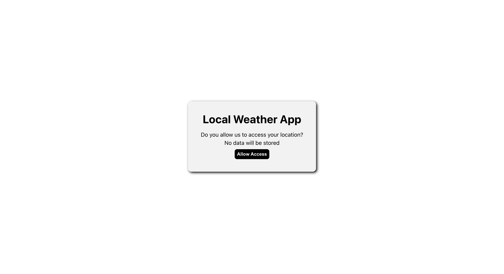
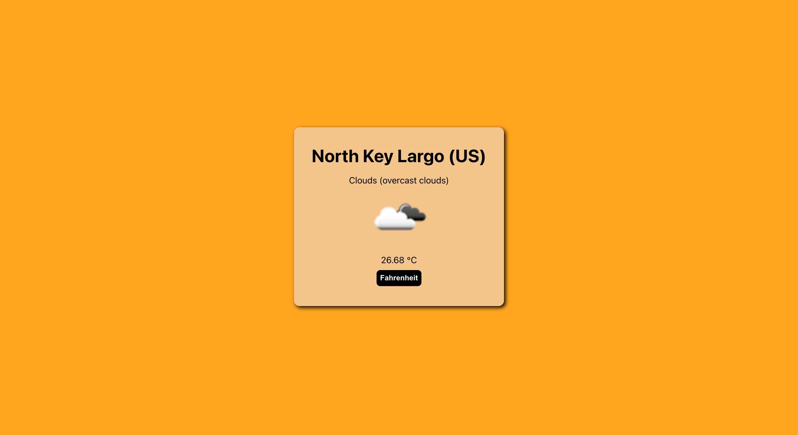
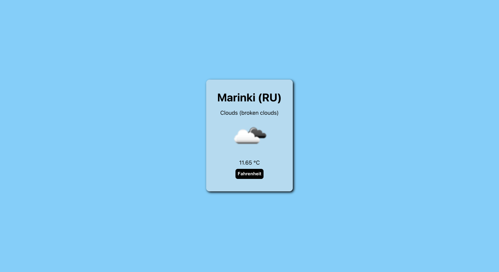

## Local Weather App

An application that gives you basic information about your local weather, built with React, JavaScript, and CSS.

## Screen Shots(s)

## Installation and Setup Instructions

Clone this repository (You will need `node` and `npm` installed globally on your machine)

Installation:

`npm install`

To Start Client:

`npm start`

To Visit App:

`localhost:3000`

## Summary

- Application features:
    - Display the temperature of your location along with a short description
    - Toggle temperature between fahrenheit and celsius
- What was the purpose of this project?
    - Practicing front-end development using the React library
    - Creating a basic app using stateful & stateless components
    - Making a basic API request